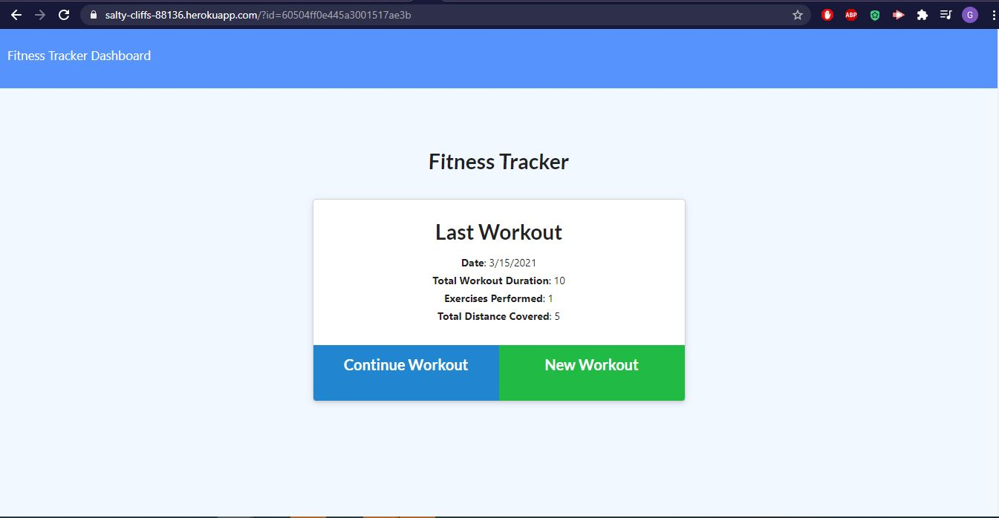
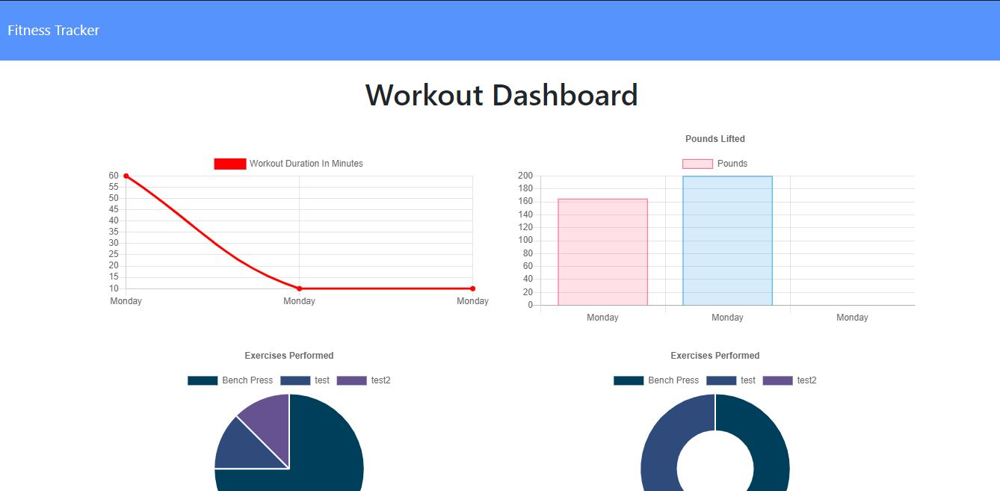

# Workout-Tracker <!-- omit in toc -->
--- 
### Table of Contents

- [Description](#description)
  - [Technologies Used](#technologies-used)
- [Installation](#installation)
- [How to use it](#how-to-use-it)
- [Future Development](#future-development)
- [Credits](#credits)
- [How to contribute](#how-to-contribute)
- [Tests](#tests)
- [License](#license)

## Live Site
[View Now](https://salty-cliffs-88136.herokuapp.com/?id=60504ff0e445a3001517ae3b)

## Description
Easy tool to keep track of your workout schedule

___Technologies Used___
- Express
- Mongodb
- Mongoose
- Heroku

___Motivation___

Practice utilizing Mongoose and MongoDB

## Installation
Project deployed. No installatioin necessary

## How to use it
When the user loads the page, they are given the option to create a new workout or continue with their last workout. The user is able to add exercises to the most recent workout plan, add exercises to a new workout plan, view the combined weight of multiple exercises from the past seven workouts, and view the total duration of each workout. 

## Future Development
Enhance user interface.

### Credits
Developers: Garth Hammonds
### How to contribute
email me

### Tests
No tests provided

### License
#####MIT
[Link to MIT licence](https://opensource.org/licenses/MIT)

### Questions
If you have a question about this software, contact the developer at:
GarthBHammonds@gmail.com

